# Luminous 달이 차오른다. 가자
### 이준혁 채희찬 태준모

# 📜목차
[1.프로젝트 소개](#-프로젝트-소개)  
[2.제출파일](#-제출-파일)  
[3.ERD](#-erd)  
[4.Class Diagram](#-class-diagram)  
[5.구현 화면](#-구현-화면)  
[6.데일리 스크럼](#-데일리-스크럼)  

## 💻 프로젝트 소개

Luminous를 통해 천문대, 캠핑장, 별자리, 운세, 날씨, 지도 정보를 얻고, 천체 관측과 관련된 정보를 공유할 수 있습니다!

## ➡️ 제출 파일

mwb, dump 파일은 **resources** 폴더 내부에 있습니다.
이미지는 **image** 폴더 내부에 있습니다.

## 📂 ERD
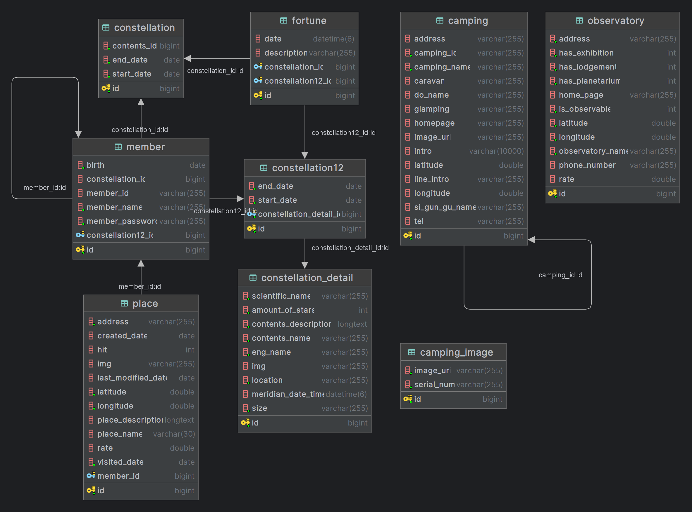

## 🖊️ Class Diagram

## 📱 구현 화면

### 메인 화면
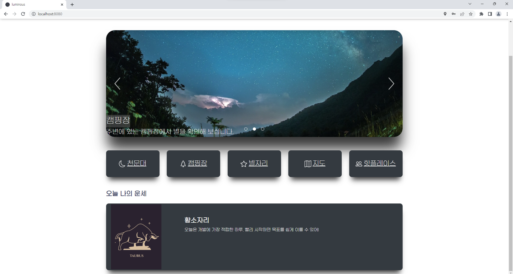

### 회원가입
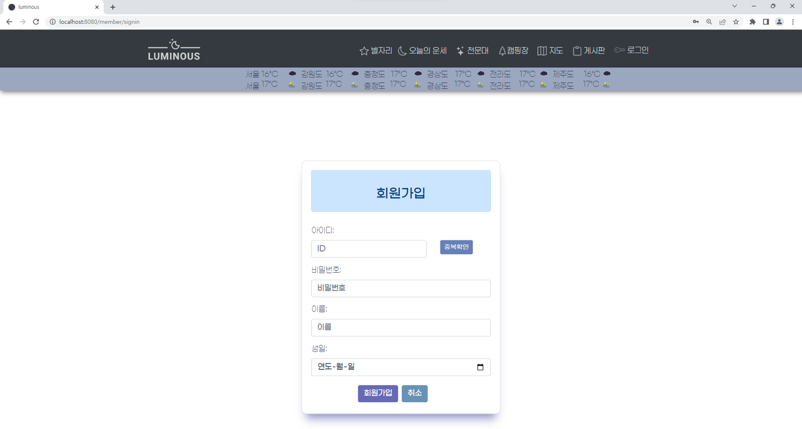

### 로그인
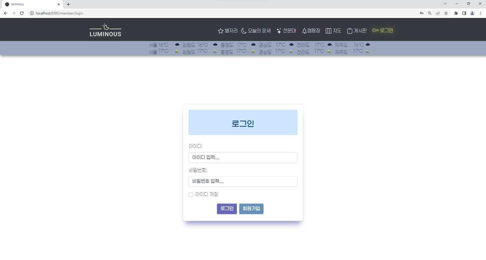

### 마이페이지
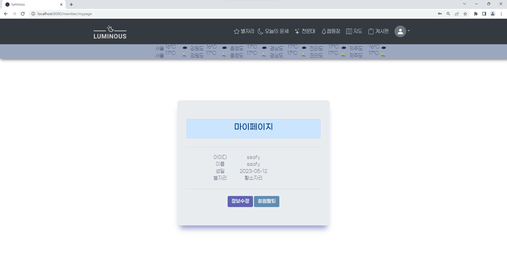

### 회원 정보 수정
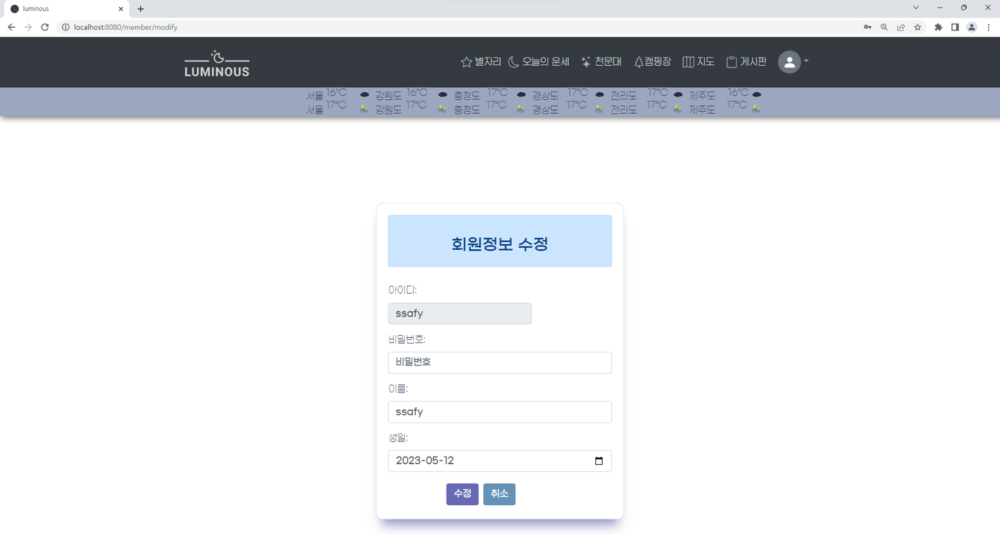

### 천문대 목록
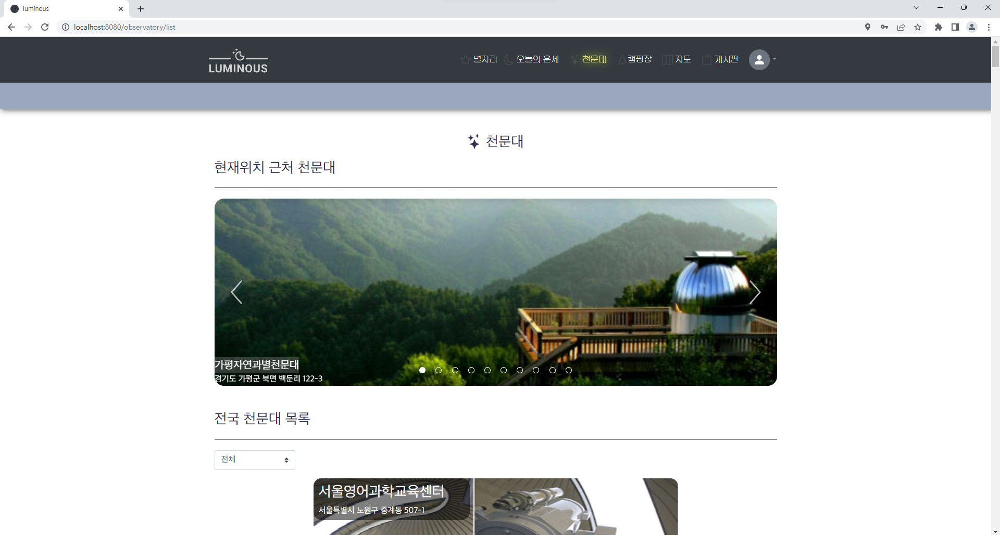

### 천문대 정보
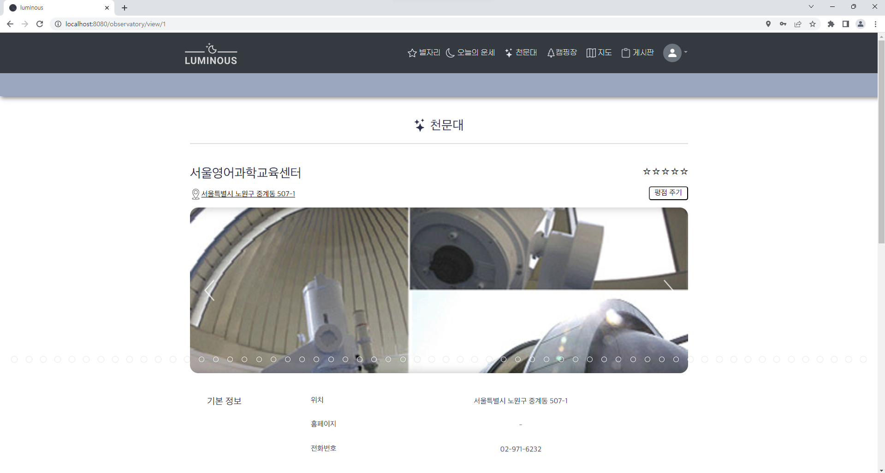

### 캠핑장 목록
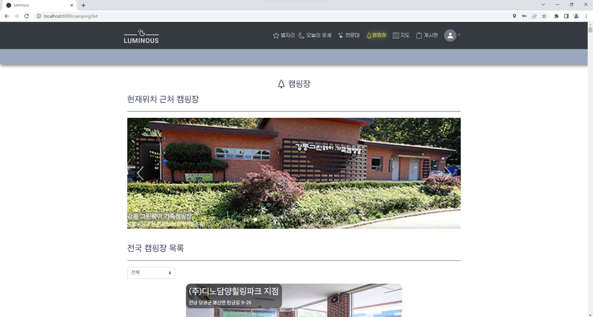

### 캠핑장 정보
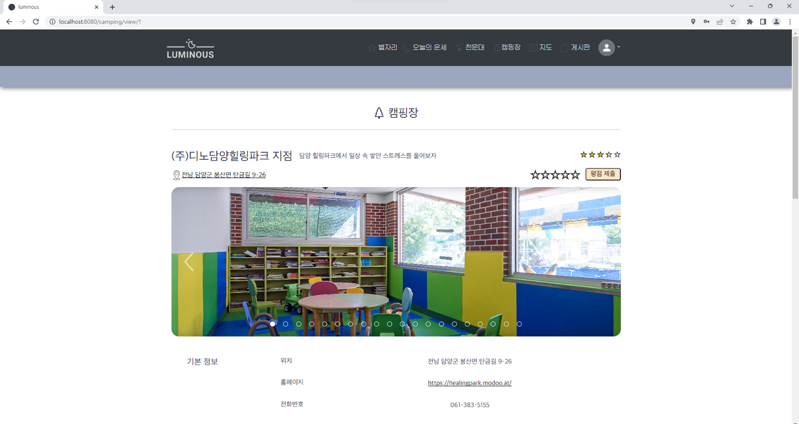

### 오늘의 운세
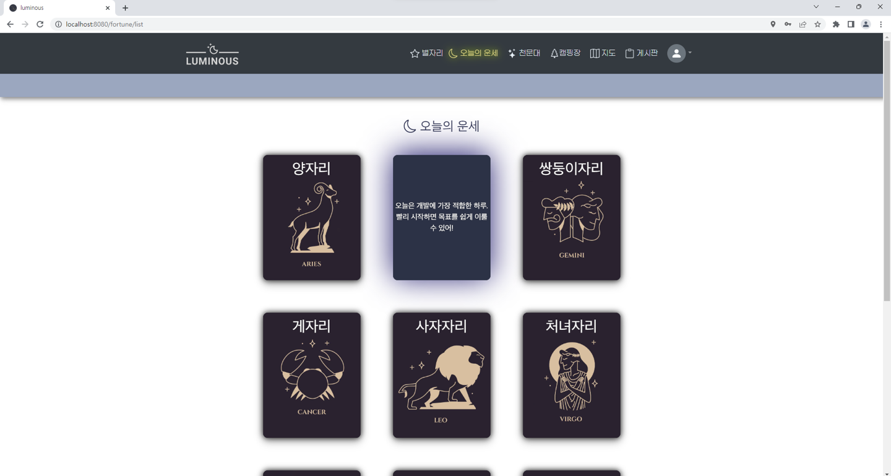

### 별자리
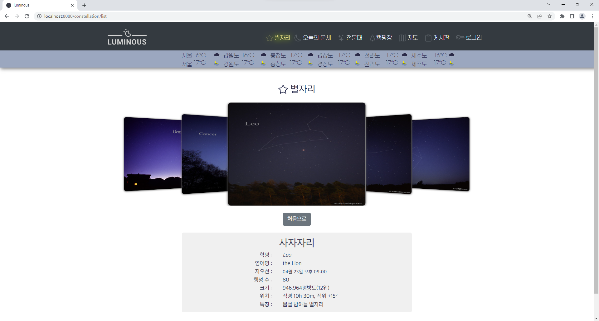

### 지도
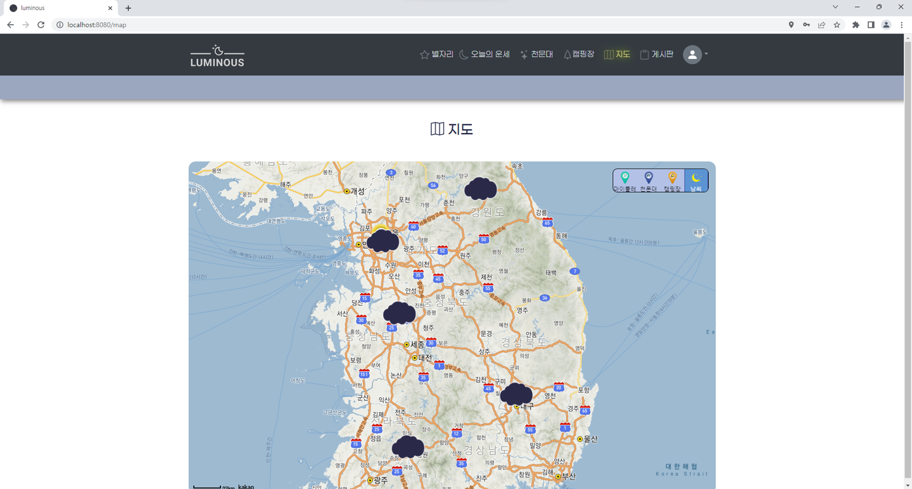
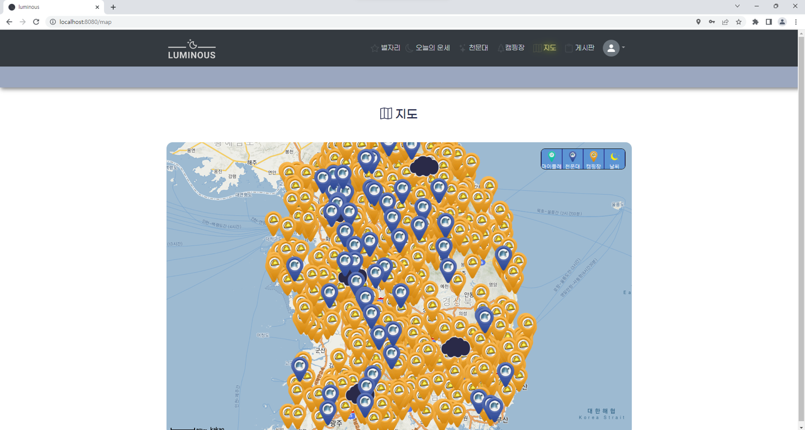

### 핫플레이스 목록
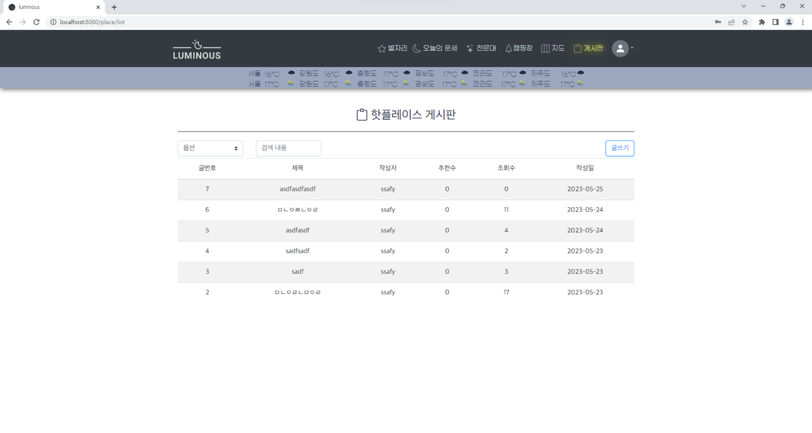

### 핫플레이스 등록
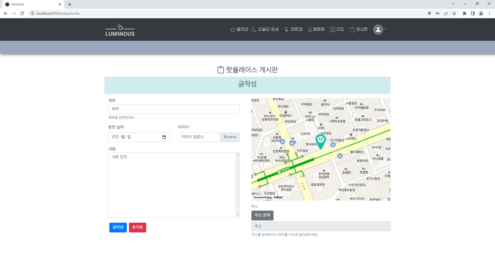

### 핫플레이스 정보
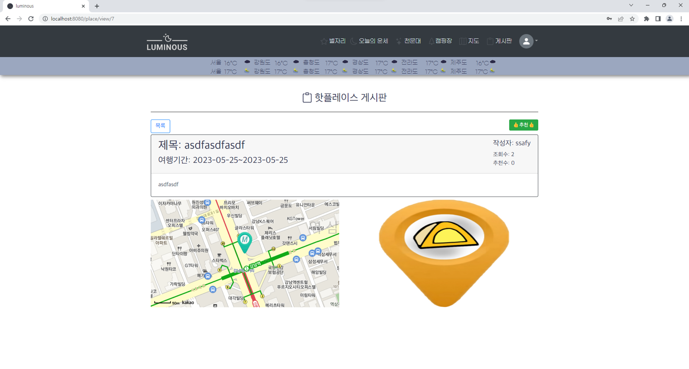

# 📗 데일리 스크럼
[230516 월](#anchor-230516)  
[230517 화](#anchor-230517)  
[230518 수](#anchor-230518)  
[230519 목](#anchor-230519)  
[230520 금](#anchor-230520)  
[230521 토](#anchor-230521)  
[230522 일](#anchor-230522)  
[230523 월](#anchor-230523)  
[230524 화](#anchor-230524)  
[230525 수](#anchor-230525)  

# 230516

**이준혁**

- SpringBoot 프로젝트 구축
    - SpringBoot 2.x , Java 11 ,JPA, MySQL
    - 인텔리제이
- 노션 정리
- todo list 정리
- constellation, fortune, observatory, place 설계
- JPA 연동
- 도메인 세팅

- 내일 할거
    - 도메인 세부 세팅필요해요
    - 연관관계 매핑

**채희찬**

- Member 회원 가입 기능 API 구현
- Member 아이디 중복 검사 기능 API 구현
- Vue 프로젝트 구축
    - Vue.js 2.x
- API 스펙 정리

**태준모**

- 도메인 설계
- DB 구축
- 화면 설계
- API 정리
    - 날씨 : 기상청_단기예보 ((구)_동네예보) 조회서비스
    - 미세먼지 : 한국환경공단_에어코리아_대기오염정보
    - 지도 : kakao map api
    - 별자리 : DB에 저장 : **과학기술정보통신부 국립중앙과학관_과학학습콘텐츠_별과별자리**

# 230517

**이준혁**

- 마이플레이스 CRUD 구현
- 마이플레이스 - 멤버 단방향 연관관계 매핑
- 마이플레이스 검색 기능
    - 멤버이름, 장소이름, 장소설명

**채희찬**

- 로그인 기능 API 구현
- 회원가입 API 구현
- JWT 토큰 발행 기능 구현
- 토큰에서 값 분리후 id 가져오기 기능 구현
- id로 사용자 검색 기능 API 구현

**태준모**

- 로그인,로그아웃 프론트 구현
- JWT 프론트 기능 구현
- 회원가입 프론트 기능 구현
- 핫플레이스 게시판 CRUD 프론트 구현

# 230518

### 오늘할 일

- [x]  기능 확정
- [x]  게시판 기능 ..?

**이준혁**

- BaseResponse, BaseException 봉투패턴 적용
- ChatGPT API를 활용한 오늘의 운세 받아오기
- 깃 이그노어 파일 설정
- 오늘의 운세 API 구현

**채희찬**

- Member 메서드 BaseResponse 적용
- Camping 공공데이터에서 데이터 DB저장 API 구현
- 로그인 오류 수정
- 회원탈퇴 API 구현

**태준모**

- [x]  카카오맵 게시판 글 자세히 보기에서 열기
- [x]  카카오맵 페이지 꽉 채우는 지도웹 만들기
- [ ]  오늘의 운세 카드 만들기 띄우는건 나중에
- [x]  회원가입 기능 및 디자인 수정
- [x]  천문대 API getLIST 구현

# 230519

### 오늘할 일

- [x]  기능 확정
- [x]  게시판 기능 ..?

**이준혁**

- BaseResponse, BaseException 봉투패턴 적용
- ChatGPT API를 활용한 오늘의 운세 받아오기
- 깃 이그노어 파일 설정
- 오늘의 운세 API 구현

**채희찬**

- Member 메서드 BaseResponse 적용
- Camping 공공데이터에서 데이터 DB저장 API 구현
- 로그인 오류 수정
- 회원탈퇴 API 구현

**태준모**

- [x]  카카오맵 게시판 글 자세히 보기에서 열기
- [x]  카카오맵 페이지 꽉 채우는 지도웹 만들기
- [ ]  오늘의 운세 카드 만들기 띄우는건 나중에
- [x]  회원가입 기능 및 디자인 수정
- [x]  천문대 API getLIST 구현

# 230520

**이준혁**

- 주말

**채희찬**

- 주말

**태준모**

- [ ]  게시판 등록, 수정, 삭제 기능 완벽히 구현
    
    회원탈퇴기능만 완료
    
- [x]  로고 만들기
- [x]  지도에 영역끼리만
- [ ]  캠프 렌더링 렉 문제 해결

# 230521

**이준혁**

- client jwt 헤더에 담기
    - axios.interceptor 설정
- 마이페이지, 로그아웃 item 선택시 이동으로 수정
- place 수정 미반영 오류 해결
- place update sql 에러 해결 테이블 명 대문자 → 소문자
- 사용자 정보로 오늘의 운세 뽑아주기 → getTodayFortune
- 로그인시 헤더에 토큰 담아 클라이언트로 보내기 → 클라이언트에서 헤더를 받는처리까지 완료
- member 엔티티에 황궁12성 별자리 관계 추가 → OneToOne

**채희찬**

- 캠핑장 정보 API → DB
- 천문대 목록 반환 API 구현

**태준모**

- 천문대 목록 API 수정

## 질문 및 고려사항

- [ ]  준혁 : jwt를 왜 localstorage에 안담고 sessionstorage에 담아용?@메모
- @준땡 교수님께서 session에 담는다고 해서용 ㅠ 저도 잘 모르겠네용 ㅠㅠ
- [ ]  준혁 :@Transactional 에 대하여
    - javax 보다 springframework의 트랜잭션이 옵션이 더 많음
    - 읽기만하는 경우 get, getList 등의 동작만 하는 경우 Transactional(readOnly =true) 옵션을 사용하는 것이 성능이 더 좋음 
    왜 why?
    → 영속성 관리를 따로 하지않기 때문에 영속성 컨텍스트가 변경감지를 위한 스냅샷을 보관하지 않음 + c추가적인 메모리를 사용하지 않음
    - 엔티티의 수정이 이루어지는 경우 트랜잭션 내에서 동작한다면 JPA 가 자동으로 update관리를 해주지만 그렇지 않은 경우에는 직접 save로 업데이트 동작을 수행해주어야함

# 230522

**이준혁**

- 황궁 12성 리스트 정보 구현 - 서버
- 별자리 리스트 정보 - 서버
- 별자리에 정보담기 - 이름이랑 정보 담기
- 서비스로직 트랜잭션 설정
- 오늘의 운세 카드 뒤에 설명 추가하기
- 오늘의 운세 카드 플립 기능 구현

**채희찬**

- 사용자 정보 수정 API 구현

**태준모**

- [x]  천문대 db 좌표도 넣기
- [x]  지도에 마이플레이스까지 다 띄우기
- [x]  게시판 등록 및 수정 오늘 완료하기
- [x]  천문대 리스트 표시 및 천문대 조회시 지도도 표시
- [x]  게시판 천문대 검색 기능 완료
- [ ]  마커 클릭 이벤트 구현
- [x]  회원 수정 완료
- [x]  회원가입 규칙 정규식 표현
- [x]  로그인 회원가입 실패시 위에 새로운 div가 생기지 않고 아래에 작은 글시로 오류 발생을 알려주도록 수정
- [ ]  지도 사이드바 구현 준비
- [x]  천문대 ui 변경

# 230523

### **오늘 할 일**

- [ ]  UI 틀 잡기
- [ ]  메인페이지 구현
- [ ]  날씨 api 가져오기
- [ ]  마이페이지에 있는 별자리 번호 별자리로 매핑
- [ ]  navbar의 회원 사진 별자리 마다 사진 바꿔주기
- [ ]  마이플레이스 게시판 댓글 (평점) 기능
- [ ]  별자리 상세 설명 페이지 구현
- [x]  회원가입시 생년월일 별자리 매핑

**이준혁**

- [x]  회원가입시 생년월일 별자리 매핑
- [x]  회원 정보 수정시 별자리 변경
- [x]  본인 별자리 네온사인 효과넣기
- [x]  카드플립의 튕기는 효과 줄이기
- [x]  별자리 값 넣기
- [x]  user status 생성
    
    USER, ADMIN, DELETED
    
- [x]  User 삭제시 status Deleted로 변경으로
- [x]  로그인 화면에서 로그인 화면시 네비게이션 가드 에러 해결
- [x]  오늘의 운세 아이콘 변경
- [x]  별자리 정보 Carousel에 넣기

**채희찬**

- [x]  캠핑장 세부 정보 DTO 수정
- [x]  캠핑 게시판 CRUD구현
- [x]  캠핑 게시판 디테일 구현
- [x]  캠핑 리스트 반환 DTO 수정
- [x]  캠핑 View 페이지 구현
- [x]  캠핑장 지역명으로 검색 API 구현
- [x]  서브 메뉴 디자인 변경
- [x]  캠핑 view 홈페이지 정보 수정

**태준모**

- [x]  로그인 페이지 UI 변경
- [x]  회원 정보 수정 기능
- [x]  아이콘 변경
- [x]  마커 클릭 이벤트 구현
- [x]  지도 사이드바 구현
- [x]  로그인 쿠키 구현 완료
- [x]  지도 UI 변경
- [x]  게시판 등록시 이미지 미리보기 구현

# 230524

### 오늘 할일

- [x]  게시판 평점 혹은 댓글 구현 ⇒ 평균 평점
- [x]  이미지 저장
- [ ]  ui 변경
- [ ]  날씨 , 홈(메인페이지)
- [ ]  경로
- [ ]  지도에서 각 좌표에 정보 매핑
- [ ]  회원 수정에 비밀번호 정규식
- [x]  navbar 회원정보 이미지 매핑
- [x]  파일 업로드
- [x]  회원 탈퇴, 관리자 status
- [ ]  별자리 UI 꾸미기

**이준혁**

- [ ]  별자리 UI 꾸미기
- [x]  회원 탈퇴, 관리자 status
- [x]  파일 업로드
- [x]  별자리 휠 처리, 키보드처리
- [x]  s3 연동으로 파일 업로드 구현
    
    [run]-[configuration]
    
    vm option에 아래 문장 추가
    
    - -Dcom.amazonaws.sdk.disableEc2Metadata=true
- [x]  place list dto 수정
- [x]  navbar 회원정보 이미지 매핑 → 아바타 이미지
- [x]  게시판 정렬기능 추가
- [x]  캠핑장과 천문대 UI 분리

**채희찬**

- [x]  캠핑장 UI 변경
- [x]  캠핑장 정보 추가
- [x]  캠핑장 location 지도로 이동
- [x]  캠핑장 평점 추가
- [x]  평점 주기 기능
- [x]  위치기반 정보로 캠핑장 목록 요청 API 구현

**태준모**

- 게시글 작성 formDATA 형식으로 변경 - 사진 추가 위해서
- MAP UI 수정
- 회원가입시 필수항목 에러처리 UX 추가

# 230525

**이준혁**

- 천문대 UI 구현
- 캠핑 상세정보 DTO 수정
- 게시글 수정 API 프론트 ,서버 오류 수정
- 핫플레이스 좋아요 기능 추가
- keyup이벤트로 타이핑마다 검색기능 구현

**채희찬**

- 메인 페이지 구현
- 메인 페이지 UI 설계
- 메인 페이지 오늘의 운세 보기 기능 구현
- 헤더 스타일 변경
- 핫플레이스 UI 수정
- 천문대 디테일 페이지 구현
- 천문대 추천 API 구현
- footer 수정

**태준모**

- 날씨 API 추가
- 날씨 이미지 렌더링
- 날씨 API 상세기능 구현
- stick sidebar로 상단 바로 이동 기능 구현
- 지도 상세정보 현재 페이지에서 열리도록 수정
- 카카오맵에서 이미지 불러오기
- 카카오맵 위의 날씨 마커 표시
- 날씨 좌표 수정
